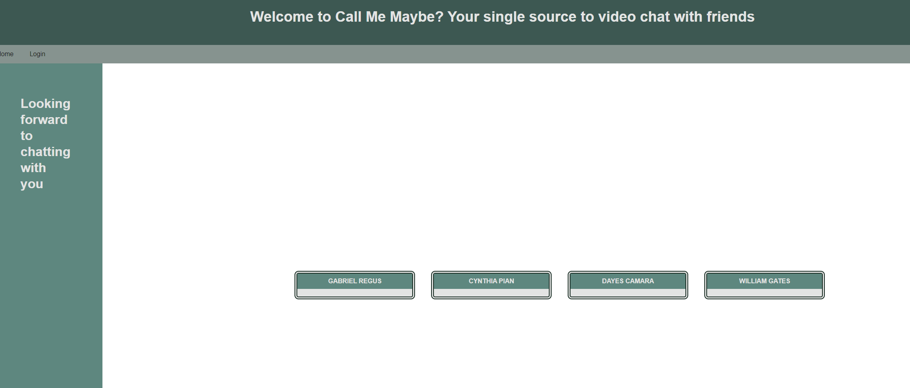
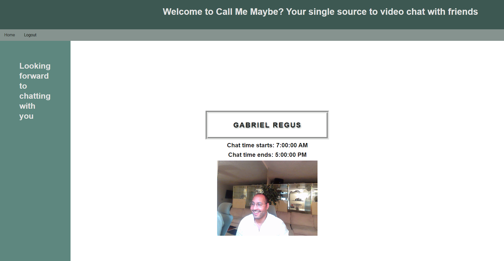

# Call Me Maybe
a face-to-face app held over the internet by means of webcams and dedicated software.
## Table of Contents

* [Description](#description)
* [Links](#links)
* [Purpose](#purpose)
* [Screenshots](#screenshots)
* [Presntation](#presentation)
* [Technologies Used](#technologies)
* [Licence](#license)
* [Notes](#notes)
## Description

Call Me Maybe is an app that can be used through a computer desktop, and allows users to connect online for video conference meetings, webinars and live chat.

## Links
<a href="https://github.com/ColumbiaCoding/2ndCall">Call Me Maybe Github Repo</a>
<a href="https://dashboard.heroku.com/apps/videocallmemaybe">Deployed Call Me Maybe App App</a>

## Purpose

t provides videotelephony and online chat services through a cloud-based peer-to-peer software platform used for video communications

## Screenshots

## Presentation Slides
<a href="https://docs.google.com/presentation/d/1MYuV9mX9qU3M8QLwb6IRjI3hsyNsnjwU7lzKWm2mpbk/edit?usp=sharing">Presentation for Call Me Maybe App App</a>

## Technologies

## License

## notes
Please view my commits and contribution to on a previous Github repo, and my user name is ColumbiaCoding
https://github.com/ColumbiaCoding/CallMeMaybe/commits/main